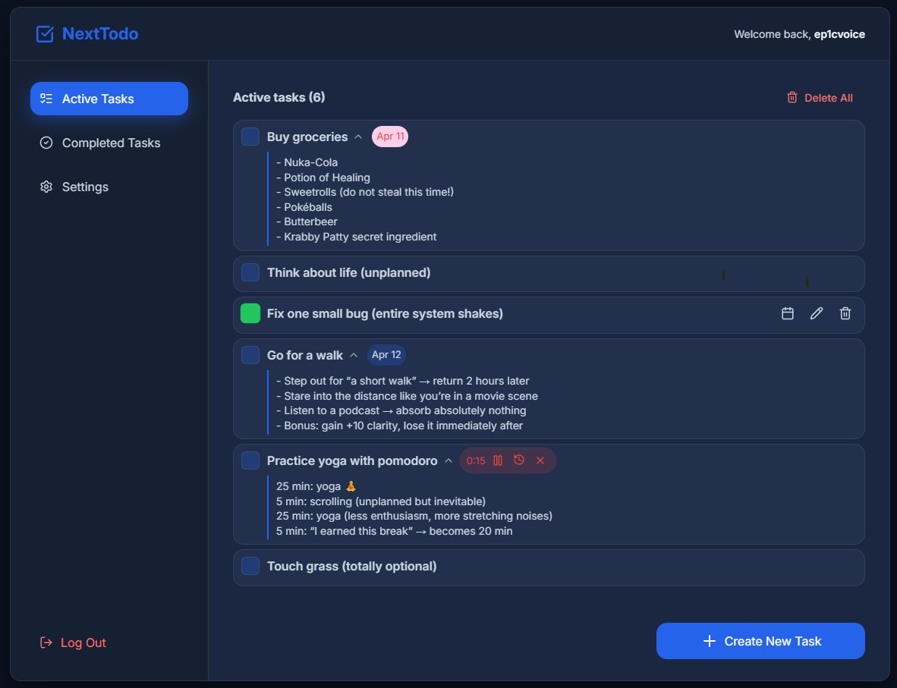

# NextTodo

> A full-stack task management app with Pomodoro timer, scheduling, and user accounts.


## Table of Contents

- [Overview](#overview)
- [Features](#features)
- [Tech Stack](#tech-stack)
- [Project Structure](#project-structure)
- [Getting Started](#getting-started)
- [Running the Project](#running-the-project)
- [API Reference](#api-reference)


## Overview

NextTodo is a full-stack productivity app built around a task list with an integrated Pomodoro timer. Users register and log in, manage their own tasks, schedule deadlines, and track focus sessions. The client is a React SPA, the server is a Fastify REST API backed by a SQLite database via Prisma.



## Features

### Tasks
- Create tasks with a title and optional description
- Expand a task to read the full description (animated reveal with left accent bar)
- Mark tasks as done / undo — completed tasks move to a separate view
- Edit task title, description, and scheduled date inline via modal
- Delete individual tasks or all active tasks at once
- Tasks sorted by priority (ascending / descending)

### Scheduling
- Assign a due date to any task via a date picker (react-day-picker)
- Visual badge on each task: neutral for future dates, highlighted for today, red for overdue

### Pomodoro Timer
- Start a focus session directly from a task row with the alarm-clock icon
- Timer runs in real time: displays elapsed time, play/pause, and stop
- Configurable session length in Settings (stored in `localStorage`, default 25 min)
- Alarm modal on session completion (audio alert + "Take a break" overlay)
- Session state is persisted server-side — resuming after a page refresh works correctly
- Only one active session at a time across all tasks

### Pomodoro History
- History icon in the active timer bar opens a popup with the last 5 completed sessions
- Each entry shows: task name, status (Completed / Interrupted), time spent vs. time set, start date and time
- Delete individual history entries
- Popup is viewport-aware: appears above or below the trigger depending on available space, clamped to screen edges on desktop; bottom-sheet style on mobile

### User Accounts
- Register / login / logout with JWT stored in an HTTP-only cookie
- Change email, change password
- Delete account (requires typing username to confirm)
- Settings panel: theme toggle (light/dark), feedback animation toggle, Pomodoro duration, fullscreen mode

### UI / UX
- Fully responsive — mobile-first layout with a slide-in sidebar
- Light and dark theme via CSS custom properties
- Animated task entry (staggered fade-slide-in)
- Toast notifications for all async actions
- Error boundary for graceful crash handling

## Tech Stack

### Client
| | |
|---|---|
| Framework | React 18 (Vite) |
| Routing | React Router v6 |
| Styling | CSS Modules + CSS custom properties |
| Icons | Lucide React |
| Date picker | react-day-picker |
| HTTP | `fetch` with credentials |
| Tests | Vitest + Testing Library |

### Server
| | |
|---|---|
| Framework | Fastify |
| ORM | Prisma (SQLite) |
| Auth | `@fastify/jwt` + `@fastify/cookie` |
| Password hashing | bcrypt (Fastify plugin) |
| Validation | Fastify JSON schema |
| API docs | Static HTML at `/api_docs` |
| Tests | Vitest |

## Project Structure

```
NextTodo/
├── client/
│   └── src/
│       ├── api/              # fetch wrappers (taskApi.js, auth.js)
│       ├── components/
│       │   ├── ActiveTasks/       # task list, delete-all modal
│       │   ├── CompletedTasks/    # completed task list
│       │   ├── ToDoItem/          # single task row, expand, calendar, mobile actions
│       │   ├── PomodoroTimer/     # live timer, alarm modal
│       │   ├── PomodoroHistory/   # history popup (portal)
│       │   ├── AddTaskModal/      # create task modal
│       │   ├── EditTaskModal/     # edit task modal
│       │   ├── UserSettings/      # settings panel
│       │   ├── Sidebar/           # navigation sidebar
│       │   ├── Header/            # top bar
│       │   ├── Toasts/            # toast notification system
│       │   └── ...               # Button, Field, Loader, ThemeSwitch, etc.
│       ├── context/          # AuthContext, FeedbackContext
│       └── helpers/          # custom hooks
│
└── server/
    └── src/
        ├── api/
        │   ├── auth.*        # register, login, logout
        │   ├── task.*        # tasks + pomodoro CRUD
        │   └── user.*        # profile, settings, delete account
        ├── interfaces/       # TypeScript request body types
        ├── plugins/          # Fastify plugins (prisma, auth, bcrypt, i18n)
        ├── prisma/           # schema.prisma, seed
        └── generated/        # Prisma client (auto-generated)
```

### Database schema (SQLite via Prisma)

```
User    id, username, email, password, isActive, lastLogin, settings (JSON)
Tasks   id, userId, taskName, taskDesc, created, scheduled, modified, isFinished
Pomo    id, userId, taskId, duration, startedAt, pausedAt, elapsed, endedAt
```

`Pomo.elapsed` stores milliseconds of accumulated running time (server-computed on every pause and end). `Pomo.duration` stores seconds. A session is considered **completed** when `elapsed >= duration * 1000`.

---

## Getting Started

### Requirements

- **Node.js** 18+ (LTS recommended)
- **npm**

```bash
node -v
npm -v
```

Download Node.js from [nodejs.org](https://nodejs.org) if not installed.

### Install & initialise

```bash
git clone https://github.com/matt400/NextTodo
cd NextTodo
npm run install:all
npm run db:init
```

`install:all` installs dependencies in root, client, and server. `db:init` runs Prisma migrations and generates the client.

### Environment

Create `server/.env`:

```env
DATABASE_URL="file:./dev.db"
```

---

## Running the Project

Open two terminals:

```bash
# Terminal 1 — API server (default: http://localhost:3000)
npm run dev:server

# Terminal 2 — React client (default: http://localhost:5173)
npm run dev:client
```

### Other useful commands

| Command | Description |
|---|---|
| `npm run db:reset` | Drop and re-create the database |
| `npm run db:seed` | Seed with example data |
| `npm run db:migrate` | Run pending Prisma migrations |
| `npm run db:generate` | Re-generate Prisma client after schema changes |
| `npm run ctest` | Run client tests (Vitest) |
| `npm run stest` | Run server tests (Vitest) |

---

## API Reference

Interactive docs are available while the server is running:

```
http://localhost:3000/api_docs
```

### Endpoint summary

| Method | Path | Description |
|---|---|---|
| POST | `/api/auth/register` | Create account |
| POST | `/api/auth/login` | Log in, set JWT cookie |
| POST | `/api/auth/logout` | Clear JWT cookie |
| GET | `/api/task` | Get all tasks |
| POST | `/api/task` | Create task |
| PATCH | `/api/task` | Update task fields |
| DELETE | `/api/task` | Delete one or more tasks |
| POST | `/api/task/startPomo` | Start a Pomodoro session |
| POST | `/api/task/pausePomo` | Pause active session |
| POST | `/api/task/resumePomo` | Resume paused session |
| POST | `/api/task/endPomo` | End session (elapsed computed server-side) |
| POST | `/api/task/getPomo` | Get pomodoro records for a task |
| GET | `/api/task/pomoHistory` | Last 5 ended sessions with task names |
| DELETE | `/api/task/pomoHistory` | Delete a history record |
| GET | `/api/user` | Get current user profile |
| PATCH | `/api/user` | Update profile / settings |
| DELETE | `/api/user` | Delete account |

All task and pomodoro endpoints require a valid JWT cookie (`access_token`).
